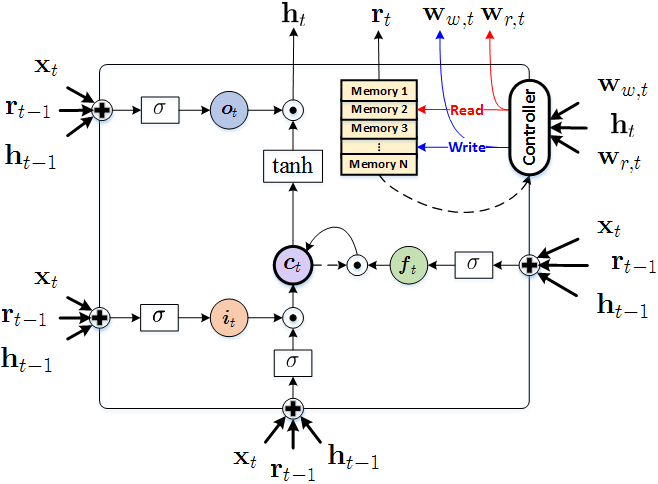
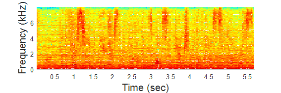
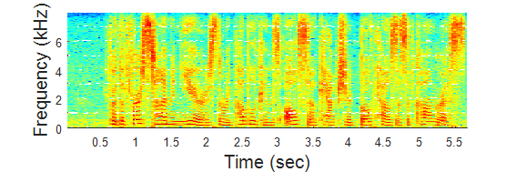
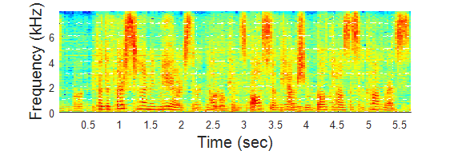
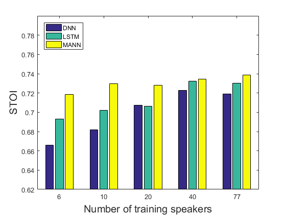
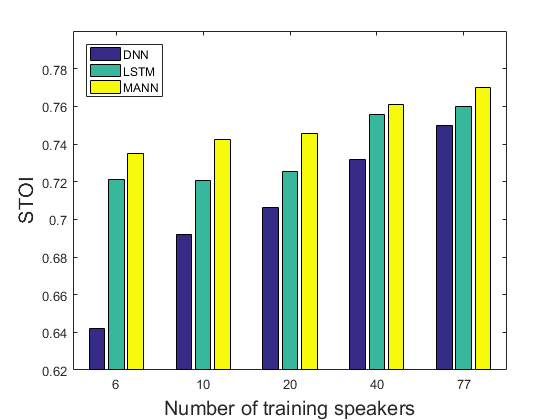
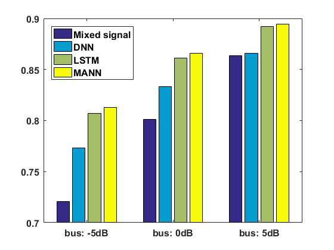
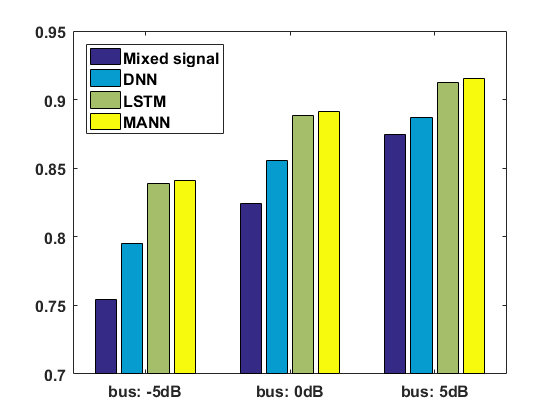
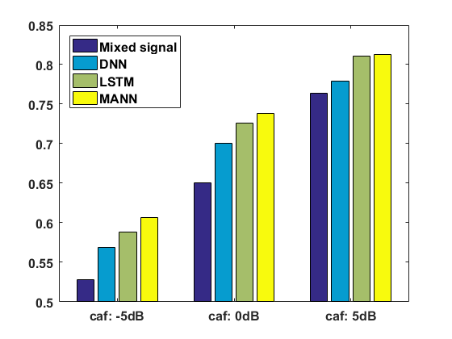
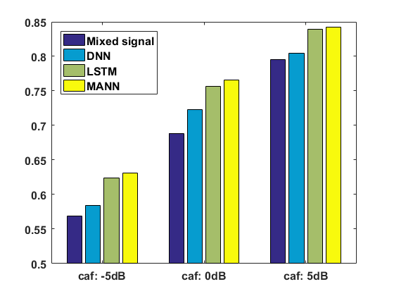

# Memory Augmented Neural Network for Source Separation
In this project, we implement neural Turing machine (NTM) for sequential signals of speech and noise in presence of different speakers and noise types.
NTM is a memory-augmented neural network which is equipped with external memory to learn long sequential data.
The information is stored with attention mechanism and read-writing scheme. 
For more details about NTM, you can refer to [Neural Turing Machine](https://arxiv.org/pdf/1410.5401.pdf).
The system architecture and experimental settings are shown in Memory Augmented Neural Network for Source Separation.

## Setting
- Hardware:
	- CPU: Intel Core i7-4930K @3.40 GHz
	- RAM: 64 GB DDR3-1600
	- GPU: NVIDIA Tesla K20c 6 GB RAM
- Tensorflow 0.12
- Dataset
	- Wall Street Journal Corpus
	- Noises are collected from [freeSFX](http://www.freesfx.co.uk/soundeffects/) and [AudioMicro](http://www.audiomicro.com/free-sound-effects)

## Result
- An example of demixed signal

||
|:--------------------------------------------:|
|Mixed signal|

||
|:--------------------------------------------:|
|Clean signal|

||
|:--------------------------------------------:|
|Demixed signal|

- STOI measure on other noises

|
:----------------------------------------:|:----------------------------------------:
Seen speakers                             |Unseen speakers

- STOI measure on bus noises

|
:--------------------------------------------:|:--------------------------------------------:
Seen speakers                                 |Unseen speakers

- STOI measure on caf noises

|
:--------------------------------------------:|:--------------------------------------------:
Seen speakers                                 |Unseen speakers

